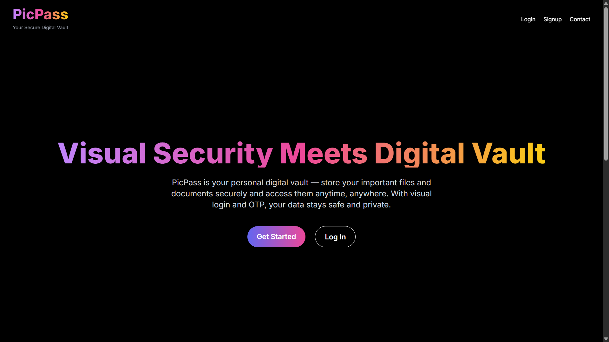
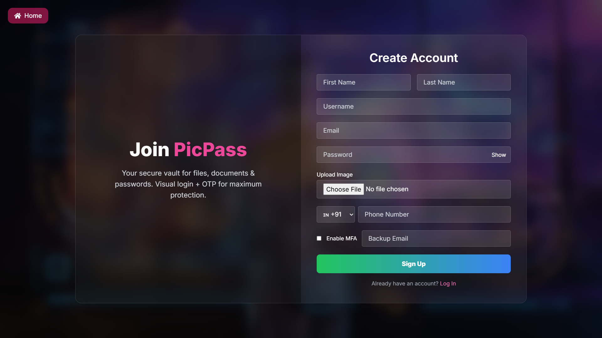
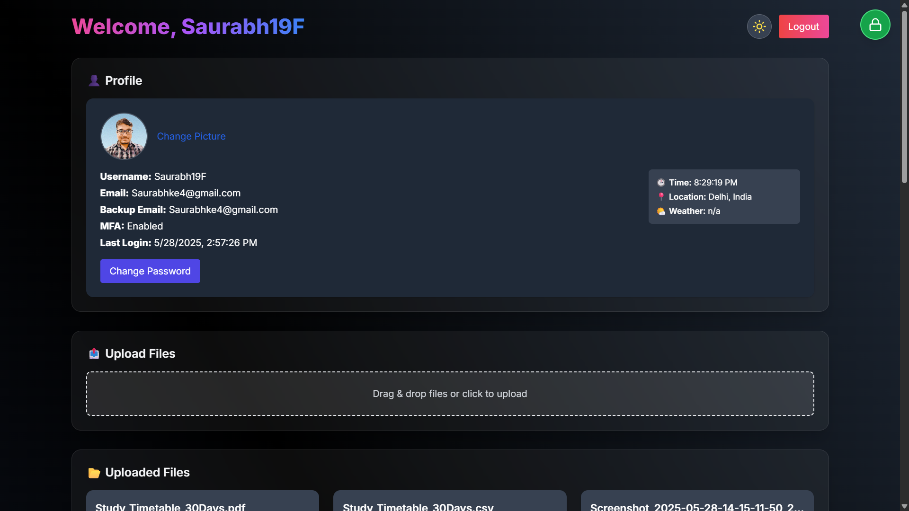

# 🔐 PicPass: Graphical Password + OTP Authentication System

PicPass is a modern, secure authentication system that combines graphical passwords with OTP verification via Twilio. Built using React.js (Vite + Tailwind + Framer Motion) and Spring Boot (Java), it features image-based login, segmented grid verification, and a responsive dashboard.

## ✨ Features
- Signup with full user info and profile picture
- Upload image and select graphical segments as a password
- Multi-step login: Username → OTP → Grid Selection
- OTP verification via Twilio (SMS)
- MFA toggle and password reset support
- Upload PDF, PPTX, DOCX files with progress
- Real-time weather, time & location info
- Dashboard analytics and file type chart
- Dark mode toggle with animated transitions

## 🧩 Tech Stack

### Frontend
- React + Vite
- Tailwind CSS
- Framer Motion
- Axios + React Hot Toast

### Backend
- Java + Spring Boot
- Spring Security + JWT Auth
- MongoDB Atlas
- Twilio Verify API
- Apache HttpClient (weather proxy)

### DevOps & Deployment
- Render (Backend)
- Netlify / Vercel (Frontend)
- Maven + Lombok

## 🖼️ Screenshots

### 🌐 Landing Page

### ❓ Why PicPass?

### 📤 Contact Section

### 🆕 Signup with Image + MFA

### 🔑 Step 1: Basic Login (Username + Password)

### 🔐 Graphical OTP Login

### 🧑‍💼 User Dashboard

### 📊 File Type Distribution

### 📋 Activity Log

🚀 Getting Started

1. Clone the repo
git clone https://github.com/Saurabh19F/PicPass.git
cd picpass-auth

2. Backend Setup (Spring Boot)
cd server
cp .env.example .env
# Edit the file and add your Twilio & MongoDB credentials

mvn clean install
mvn spring-boot:run

Required .env keys:
MONGODB_URI=
TWILIO_ACCOUNT_SID=
TWILIO_AUTH_TOKEN=
TWILIO_VERIFY_SID=
JWT_SECRET=

3. Frontend Setup (React + Vite)
cd client
npm install
npm run dev

🧪 API Endpoints

Auth
- POST /auth/signup – Register user
- POST /auth/login – Verify username & password
- POST /auth/verify-otp-grid – OTP + grid segment validation
- GET /auth/user-image/{username} – Fetch user image

Dashboard
- POST /dashboard/upload – Upload file
- GET /dashboard/activity/{username} – View user logs
- PUT /dashboard/avatar/{username} – Update profile picture
- PUT /dashboard/password – Change password
- GET /dashboard/weather – Location-based weather via proxy

🌐 Deployment

Backend on Render
1. Connect your GitHub repo to Render
2. Add environment variables in the dashboard
3. Set build command: ./mvnw clean install
4. Set start command: java -jar target/*.jar

Frontend on Netlify
1. Connect your repo
2. Build command: npm run build
3. Publish directory: dist

📌 Notes
- Only verified numbers can receive OTP on Twilio trial account
- Ensure the image segment grid matches on signup and login
- Customize OTP timeout or JWT expiration via application.properties

🙌 Acknowledgements
- Twilio Verify API
- MongoDB Atlas
- Framer Motion
- Render Deployment

📄 License
This project is licensed under the MIT License.
